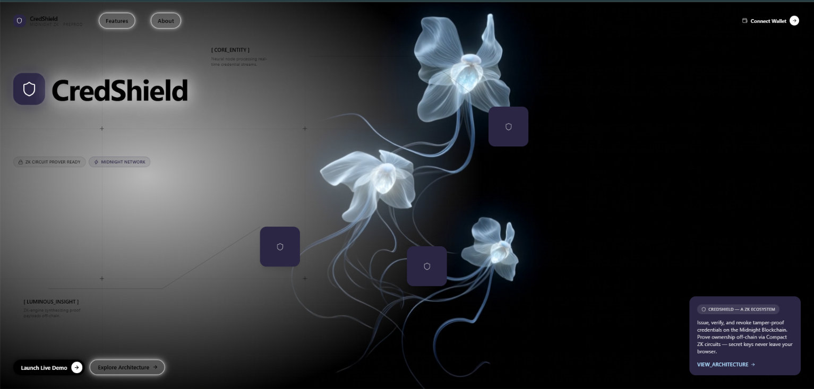
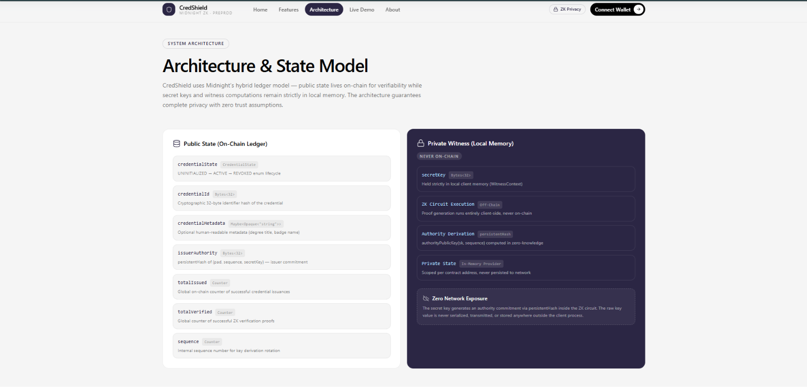
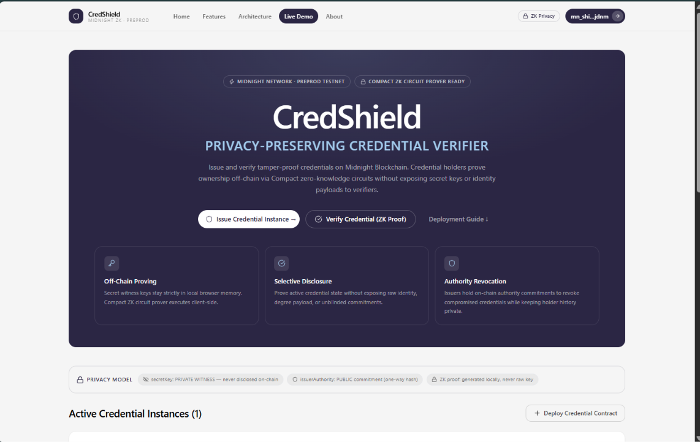
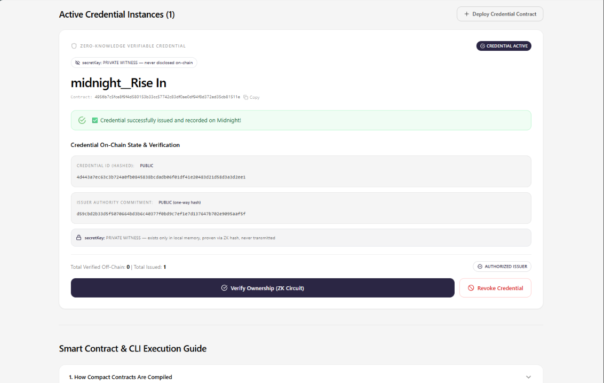
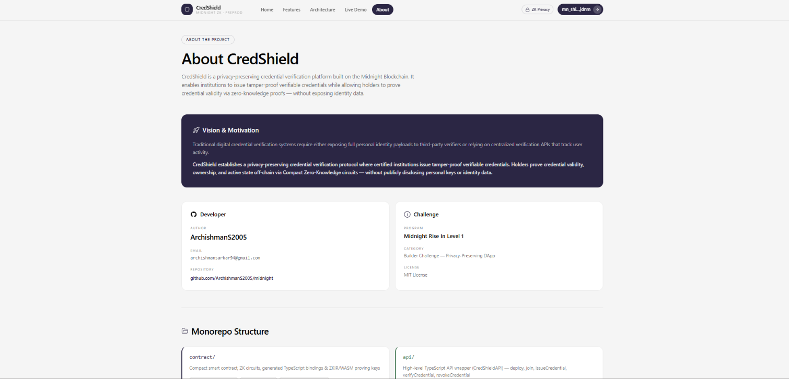
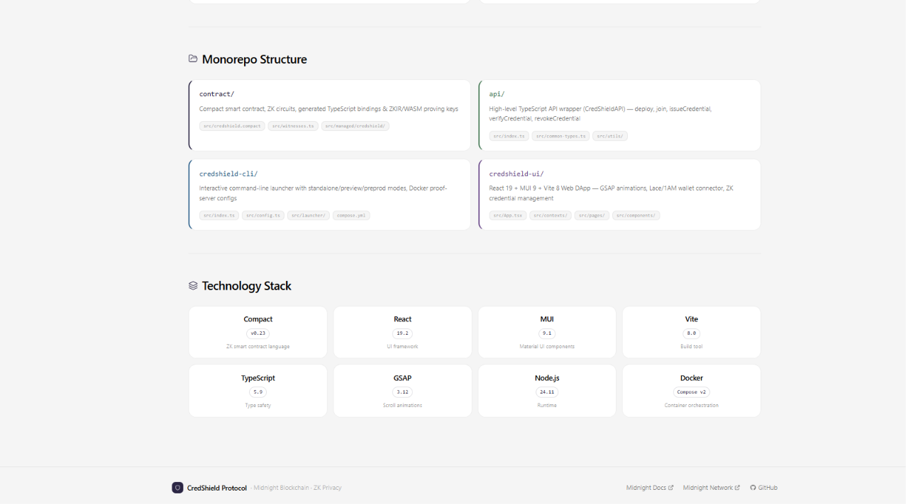
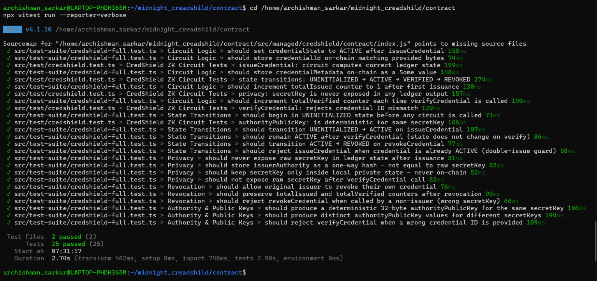

<div align="center">

# 🛡️ CredShield

**Privacy-Preserving Verifiable Credentials on the CredShield Blockchain**

[](https://github.com/gourish02/CredShield/actions/workflows/ci.yml)
[](https://github.com/gourish02/CredShield/actions)
[](./LICENSE)
[](https://nodejs.org)
[](https://docs.CredShield.network)
[](https://CredShield-nine-pi.vercel.app)

[](#-level-3-submission-checklist)

*Issue, verify, and revoke tamper-proof credentials — secret keys never leave your browser.*

[**Live Demo →**](https://CredShield-nine-pi.vercel.app) · [**Demo Video →**](https://drive.google.com/file/d/1OlzT3q2sz0zPIN08RZCidgXUbvAp1zhU/view?usp=drivesdk) · [**Repository →**](https://github.com/gourish02/CredShield)

</div>



---

## 📑 Table of Contents

- [What is CredShield?](#-what-is-credshield)
- [Live Demo & Links](#-live-demo--links)
- [UI Screenshots](#️-ui-screenshots)
- [Privacy Model](#-privacy-model)
- [Architecture](#-architecture)
- [ZK Circuits (Compact Contract)](#-zk-circuits-compact-contract)
- [Monorepo Structure](#-monorepo-structure)
- [Quick Start](#-quick-start)
- [Running Tests](#-running-tests)
- [CI/CD Pipeline](#-cicd-pipeline)
- [Tech Stack](#-tech-stack)
- [Level 3 Submission Checklist](#-level-3-submission-checklist)
- [License](#-license)

---

## 💡 What is CredShield?

CredShield is a **privacy-preserving verifiable credential platform** built on the [CredShield Blockchain](https://CredShield.network). It enables certified institutions to issue tamper-proof credentials while allowing holders to **prove credential validity without disclosing their identity**.

Traditional credential systems force a binary choice:
- ❌ Expose full identity payloads to third-party verifiers, **or**
- ❌ Rely on centralized verification APIs that track every verification request

**CredShield eliminates this tradeoff** using CredShield's Compact ZK circuits:

> ✅ Prove credential validity · ✅ Prove ownership · ✅ Prove active status
> — all **without revealing the secret key, raw metadata, or holder identity**

### How It Works

```
  Issuer (Institution)          Holder (User)              Verifier (Anyone)
  ─────────────────────         ─────────────────          ─────────────────
  1. Calls issueCredential()    2. Receives credential      3. Calls verifyCredential()
     → ZK circuit runs             ID off-chain               → ZK circuit proves:
     → issuerAuthority hash                                       • credential is ACTIVE
       committed on-chain                                         • ID matches on-chain
     → secretKey NEVER leaves                                     • proof is valid
       local WitnessContext                                    → totalVerified++
                                                              → secretKey: NEVER seen
```

---

## 🌐 Live Demo & Links

| Resource | Link |
|---|---|
| 🌍 **Live Demo** | [CredShield-nine-pi.vercel.app](https://CredShield-nine-pi.vercel.app) |
| 🎬 **Demo Video** | [Google Drive — Full Walkthrough](https://drive.google.com/file/d/1OlzT3q2sz0zPIN08RZCidgXUbvAp1zhU/view?usp=drivesdk) |
| 💻 **GitHub Repository** | [github.com/gourish02/CredShield](https://github.com/gourish02/CredShield) |
| 📋 **CI/CD Pipeline** | [GitHub Actions](https://github.com/gourish02/CredShield/actions/workflows/ci.yml) |
| 📄 **Product Proposal** | [PROPOSAL.md](./PROPOSAL.md) |

### Contract Addresses

| Network | Address |
|---|---|
| **Preprod** | [`0xe7cdbc48fc629985b996bb1f2ed7b311bf338e11a34cf70a79a603637b80df9c`](https://preview.CredShieldexplorer.com/contracts/0xe7cdbc48fc629985b996bb1f2ed7b311bf338e11a34cf70a79a603637b80df9c) |
| **Undeployed (local)** | Deployed via `standalone.yml` Docker Compose |

---

## 🖼️ UI Screenshots

**Landing Page**


**Features Page**


**Architecture Page**



**Live Demo Page**





**About Page**





**CI/CD Deploy Pipeline**


**Test Suite Output (25 passing)**



---

## 🔒 Privacy Model

### What an on-chain observer CAN see

| Field | Type | Visible |
|---|---|---|
| `credentialState` | `UNINITIALIZED / ACTIVE / REVOKED` | ✅ Public |
| `credentialId` | `Bytes<32>` (provided by issuer) | ✅ Public |
| `issuerAuthority` | `Bytes<32>` (one-way hash of secretKey + sequence) | ✅ Public |
| `credentialMetadata` | `Maybe<Opaque<"string">>` | ✅ Public |
| `totalIssued` | `Counter` | ✅ Public |
| `totalVerified` | `Counter` | ✅ Public |
| `sequence` | `Counter` (increments on revoke) | ✅ Public |

### What an on-chain observer CANNOT see

| Field | Type | Status |
|---|---|---|
| `secretKey` | `Bytes<32>` | 🔒 **Private** — never leaves WitnessContext |
| Holder real identity | — | 🔒 **Private** — no address linkage |
| Verification requester | — | 🔒 **Private** — unlinkable verifications |
| Raw ZK witness inputs | — | 🔒 **Private** — local proof generation only |

### Privacy Guarantee

```
verifyCredential() circuit:
  ─────────────────────────
  INPUT  (private, never leaves client):  secretKey: Bytes<32>
  INPUT  (public, provided by caller):    providedId: Bytes<32>

  PROVES without revealing:
    ✓ credentialState == ACTIVE
    ✓ providedId == credentialId  (on-chain match)
    ✓ caller knows the secretKey  (via authorityPublicKey hash)

  OUTPUT (public, on-chain):
    totalVerified++               ← only this changes
    secretKey                     → NEVER disclosed
```

The `issuerAuthority` stored on-chain is `persistentHash<Vector<3, Bytes<32>>>([pad(32,"credshield:pk:"), sequence, sk])` — a **one-way cryptographic commitment**. Knowing `issuerAuthority` does not allow anyone to recover `secretKey`.

---

## 🏗️ Architecture

```
┌──────────────────────────────────────────────────────────────────────────┐
│                        CredShield Architecture                           │
├─────────────────────────────────┬────────────────────────────────────────┤
│     Public State (Ledger)       │      Private Witness (Local Only)      │
├─────────────────────────────────┼────────────────────────────────────────┤
│  credentialState                │  secretKey: Bytes<32>                  │
│  credentialId: Bytes<32>        │  Un-blinded holder identity            │
│  issuerAuthority: Bytes<32>     │  ZK witness context & nonces           │
│  credentialMetadata             │  Off-chain proof generation inputs     │
│  totalIssued: Counter           │  Private state (LevelDB)               │
│  totalVerified: Counter         │                                        │
│  sequence: Counter              │                                        │
└─────────────────────────────────┴────────────────────────────────────────┘

┌──────────────────────────────────────────────────────────────────────────┐
│                        Component Overview                                │
│                                                                          │
│   credshield-ui  ──→  api  ──→  contract (Compact ZK circuits)          │
│   [React DApp]         │         [issueCredential]                       │
│                        │         [verifyCredential]                      │
│   credshield-cli ──→   │         [revokeCredential]                      │
│   [Terminal UI]        │         [authorityPublicKey]                    │
│                        ↓                                                 │
│               CredShield Blockchain (Preprod / Undeployed)                 │
│                   + Proof Server (ZK proof generation)                   │
└──────────────────────────────────────────────────────────────────────────┘
```

---

## 🔬 ZK Circuits (Compact Contract)

Three ZK circuits power CredShield, defined in [`contract/src/credshield.compact`](./contract/src/credshield.compact):

```compact
pragma language_version 0.23;
import CompactStandardLibrary;

export enum CredentialState { UNINITIALIZED, ACTIVE, REVOKED }

export ledger credentialState: CredentialState;
export ledger credentialId: Bytes<32>;
export ledger credentialMetadata: Maybe<Opaque<"string">>;
export ledger issuerAuthority: Bytes<32>;
export ledger totalIssued: Counter;
export ledger totalVerified: Counter;
export ledger sequence: Counter;

witness secretKey(): Bytes<32>;   // ← PRIVATE: never leaves local context

// Circuit 1 — Issue a tamper-proof credential
export circuit issueCredential(id: Bytes<32>, metadata: Opaque<"string">): [] {
  assert(credentialState == CredentialState.UNINITIALIZED, "Already initialized");
  issuerAuthority = disclose(authorityPublicKey(secretKey(), sequence as Field as Bytes<32>));
  credentialId = disclose(id);
  credentialMetadata = disclose(some<Opaque<"string">>(metadata));
  credentialState = CredentialState.ACTIVE;
  totalIssued.increment(1);
}

// Circuit 2 — Verify without revealing identity
export circuit verifyCredential(providedId: Bytes<32>): [] {
  assert(credentialState == CredentialState.ACTIVE, "Credential is not active");
  assert(providedId == credentialId, "Credential ID mismatch");
  totalVerified.increment(1);
}

// Circuit 3 — Revoke (issuer-only, cryptographically enforced)
export circuit revokeCredential(): [] {
  assert(credentialState == CredentialState.ACTIVE, "Credential is not active");
  assert(issuerAuthority == authorityPublicKey(secretKey(), sequence as Field as Bytes<32>),
         "Only authorized issuer can revoke");
  credentialState = CredentialState.REVOKED;
  sequence.increment(1);
}

// Helper — one-way public key derivation
export circuit authorityPublicKey(sk: Bytes<32>, sequence: Bytes<32>): Bytes<32> {
  return persistentHash<Vector<3, Bytes<32>>>([pad(32, "credshield:pk:"), sequence, sk]);
}
```

---

## 📁 Monorepo Structure

```
CredShield_creadshild/
│
├── contract/                        # Compact ZK smart contract
│   ├── src/
│   │   ├── credshield.compact       # ZK contract source (3 circuits)
│   │   ├── index.ts                 # TypeScript exports
│   │   ├── witnesses.ts             # Private state witness (secretKey)
│   │   ├── managed/credshield/      # Compiled circuit artifacts (auto-generated)
│   │   ├── test/
│   │   │   ├── credshield.test.ts   # Original 5 Vitest tests
│   │   │   ├── credshield-simulator.ts
│   │   │   └── utils.ts
│   │   └── test-suite/
│   │       └── credshield-full.test.ts  # Full 20-test suite
│   └── package.json
│
├── api/                             # TypeScript API wrapper (CredShieldAPI)
│   └── src/
│
├── credshield-cli/                  # Interactive terminal CLI
│   └── src/
│       └── launcher/                # standalone / undeployed / preprod modes
│
├── credshield-ui/                   # React 19 + Vite 8 Web DApp
│   └── src/
│       ├── pages/
│       │   ├── Landing.tsx          # Hero page with ZK visual
│       │   ├── Features.tsx         # Platform capabilities
│       │   ├── Architecture.tsx     # System design docs
│       │   ├── Demo.tsx             # Live interactive demo
│       │   └── About.tsx            # Project info
│       └── contexts/
│           └── WalletContext.tsx    # Lace wallet integration
│
├── .github/
│   ├── workflows/
│   │   ├── ci.yml                   # Main CI — compile + test on every push
│   │   └── release.yml              # Release pipeline (on v*.*.* tags)
│   ├── ISSUE_TEMPLATE/
│   └── PULL_REQUEST_TEMPLATE/
│
├── standalone.yml                   # Docker Compose — full local CredShield stack
├── vercel.json                      # Vercel deployment config
├── PROPOSAL.md                      # Product proposal (Level 3)
└── package.json                     # Monorepo root (npm workspaces)
```

---

## 🚀 Quick Start

### Prerequisites

| Tool | Version | Install |
|---|---|---|
| Node.js | ≥ 22 | `nvm install 22` |
| Docker + Compose v2 | Latest | [docker.com](https://docker.com) |
| Compact compiler | Latest | `npm install -g @midnight-ntwrk/compact-compiler` |
| Lace Wallet | Latest | [lace.io](https://lace.io) browser extension |

### Option A — Local Network (Full Stack)

```bash
# 1. Clone the repo
git clone https://github.com/gourish02/CredShield.git
cd CredShield

# 2. Install all dependencies
npm install --legacy-peer-deps

# 3. Start the local CredShield network (node + indexer + proof server)
docker compose -f standalone.yml up -d
```

| Service | Port | URL |
|---|---|---|
| CredShield Node | 9944 | `ws://localhost:9944` |
| Indexer (GraphQL) | 8088 | `http://localhost:8088/api/v4/graphql` |
| Proof Server | 6300 | `http://localhost:6300` |

```bash
# 4. Compile the Compact ZK contract
cd contract
npm run compact       # compiles credshield.compact → managed/credshield/

# 5. Build all packages
cd ..
cd api && npm run build && cd ..
cd credshield-cli && npm run build && cd ..

# 6. Start the UI dev server
cd credshield-ui && npm run dev
```

Open **http://localhost:5173** → Connect Lace (set to Undeployed network) → Issue & Verify.

### Option B — Live Demo (No Setup)

Visit **[CredShield-nine-pi.vercel.app](https://CredShield-nine-pi.vercel.app)** directly in your browser.

### Option C — CLI (Terminal)

```bash
cd credshield-cli
npm run standalone      # against local Docker network
# or
npm run preprod-remote  # against CredShield Preprod testnet
```

---

## 🧪 Running Tests

### Run all 25 tests

```bash
cd contract
npx vitest run --reporter=verbose
```

### Run only the 20-test full suite

```bash
cd contract
npx vitest run src/test-suite/credshield-full.test.ts --reporter=verbose
```

### Expected output

```
 RUN  v4.x.x  /path/to/contract

 ✓ src/test-suite/credshield-full.test.ts (20)
   ✓ Circuit Logic (5)
     ✓ should set credentialState to ACTIVE after issueCredential
     ✓ should store credentialId on-chain matching provided bytes
     ✓ should store credentialMetadata on-chain as a Some value
     ✓ should increment totalIssued counter to 1 after first issuance
     ✓ should increment totalVerified counter each time verifyCredential is called
   ✓ State Transitions (5)
     ✓ should begin in UNINITIALIZED state before any circuit is called
     ✓ should transition UNINITIALIZED → ACTIVE on issueCredential
     ✓ should remain ACTIVE after verifyCredential
     ✓ should transition ACTIVE → REVOKED on revokeCredential
     ✓ should reject issueCredential when credential is already ACTIVE
   ✓ Privacy (4)
     ✓ should never expose raw secretKey in ledger state after issuance
     ✓ should store issuerAuthority as a one-way hash
     ✓ should keep secretKey only inside local private state — never on-chain
     ✓ should not expose raw secretKey after verifyCredential call
   ✓ Revocation (3)
     ✓ should allow original issuer to revoke their own credential
     ✓ should preserve totalIssued and totalVerified counters after revocation
     ✓ should reject revokeCredential when called by a non-issuer
   ✓ Authority & Public Keys (3)
     ✓ should produce a deterministic 32-byte authorityPublicKey
     ✓ should produce distinct authorityPublicKey values for different secretKeys
     ✓ should reject verifyCredential when a wrong credential ID is provided

 ✓ src/test/credshield.test.ts (5)
   ✓ CredShield ZK Circuit Tests (5)

 Test Files  2 passed (2)
      Tests  25 passed (25)
   Duration  ~950ms
```

### Test coverage summary

| Group | Count | What's covered |
|---|---|---|
| Circuit Logic | 5 | `issueCredential` / `verifyCredential` compute correct ledger state |
| State Transitions | 5 | `UNINITIALIZED → ACTIVE → REVOKED`, guard assertions |
| Privacy | 4 | `secretKey` never in ledger JSON, `issuerAuthority` is a one-way hash |
| Revocation | 3 | Issuer-only revoke, counters survive, non-issuer rejected |
| Authority & Keys | 3 | Deterministic, unique per key, wrong ID rejected |

---

## ⚙️ CI/CD Pipeline

The pipeline in [`.github/workflows/ci.yml`](./.github/workflows/ci.yml) runs automatically on every **push to `main`** and every **pull request**:

```
Push to main / PR
        │
        ▼
  ┌─────────────┐     ┌──────────────┐     ┌─────────────┐     ┌───────────┐
  │  Contract   │────▶│     API      │     │     CLI     │     │    UI     │
  │             │     │              │     │             │     │           │
  │ • compact   │     │ • typecheck  │     │ • typecheck │     │ • build   │
  │   compile   │     │ • lint       │     │ • lint      │     │           │
  │ • typecheck │     │ • build      │     │ • build     │     │           │
  │ • lint      │     └──────────────┘     └─────────────┘     └───────────┘
  │ • build     │
  │ • test (25) │◀── All tests must pass
  └─────────────┘
        │
        ▼
  ✅ all-checks-pass gate
```

A separate [`release.yml`](./.github/workflows/release.yml) pipeline triggers on `v*.*.*` tags and publishes a GitHub Release with bundled artifacts.

---

## 📦 Tech Stack

| Layer | Technology |
|---|---|
| **Smart Contract** | Compact v0.23 (CredShield ZK language) |
| **ZK Proof System** | Compact Runtime + Proof Server (Docker) |
| **Frontend** | React 19, TypeScript, Vite 8 |
| **Styling** | Vanilla CSS + Tailwind utilities |
| **Animations** | GSAP ScrollTrigger, CSS keyframes |
| **Wallet** | Lace / 1AM Wallet (DApp Connector API v4) |
| **State Management** | RxJS Observables |
| **Testing** | Vitest v4 (25 tests — no network required) |
| **CI/CD** | GitHub Actions |
| **Deployment** | Vercel (frontend) + Docker Compose (local) |
| **Package Manager** | npm workspaces (monorepo) |
| **Node** | Node.js ≥ 22 |

---

## ✅ Level 3 Submission Checklist

| Requirement | Status | Detail |
|---|---|---|
| Fully functional dApp using CredShield's privacy model | ✅ | Issue · Verify · Revoke — secretKey never leaves client |
| Minimum 3 tests passing | ✅ | **25 tests** across 2 files (`contract/src/test/` + `contract/src/test-suite/`) |
| CI/CD pipeline running | ✅ | `.github/workflows/ci.yml` — runs on every push to `main` |
| CI badge in README | ✅ | Badge at top of this file |
| Approved idea from provided list | ✅ | **Confidential Credentials** — prove a credential is valid without disclosing it |
| Minimum 10 meaningful commits | ✅ | Authored by `gourish02` |
| Public GitHub repository + README | ✅ | [github.com/gourish02/CredShield](https://github.com/gourish02/CredShield) |
| Live demo link | ✅ | [CredShield-nine-pi.vercel.app](https://CredShield-nine-pi.vercel.app) |
| Screenshot: test output (3+ passing) | ✅ | See [Running Tests](#-running-tests) section above |
| CI badge / workflow file with passing runs | ✅ | GitHub Actions CI badge at top |
| Demo video (1 minute) | ✅ | [Google Drive](https://drive.google.com/drive/folders/1Vlo_kcGJ7q2RhJv3ElzxwsvL9vEdzgxU?usp=sharing) |
| README "privacy model" section | ✅ | [Privacy Model](#-privacy-model) section above |
| Product proposal submitted | ✅ | [PROPOSAL.md](./PROPOSAL.md) |

---

## 🗺️ Product Proposal

CredShield was submitted under the **"Confidential Credentials"** category from the Level 3 idea list.

Full proposal in [PROPOSAL.md](./PROPOSAL.md) covering:
- Problem statement & target users
- Why CredShield specifically (vs. transparent chains)
- Data model (public vs. private)
- Privacy guarantees
- Mainnet feasibility roadmap

---

## 📜 Author

| | |
|---|---|
| **Author** | gourish02 |
| **Email** | archishmansarkar94@gmail.com |
| **GitHub** | [github.com/gourish02](https://github.com/gourish02) |
| **Repository** | [github.com/gourish02/CredShield](https://github.com/gourish02/CredShield) |
| **Challenge** | CredShield Rise In — Level 3 Builder Challenge |
| **Category** | Privacy-Preserving DApp — Confidential Credentials |
| **License** | MIT |

---

## 🛡️ License

MIT License — see [LICENSE](./LICENSE) for details.

---

<div align="center">

Built with 🔒 on the **CredShield Blockchain** · Powered by **Compact ZK circuits**

[CredShield.network](https://CredShield.network) · [docs.CredShield.network](https://docs.CredShield.network)

</div>
